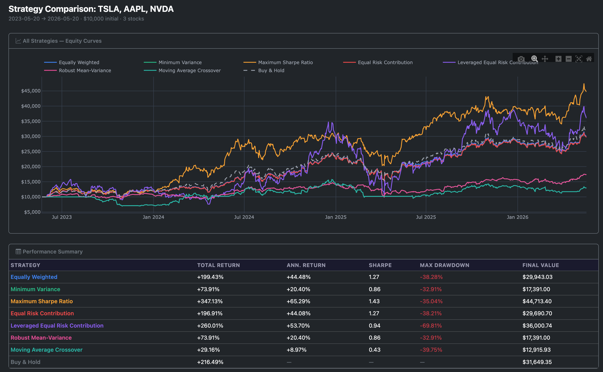

# StockBacktester

A web-based portfolio backtesting tool built with Flask. Select stocks, choose a strategy, set a date range, and instantly see simulated portfolio performance versus a benchmark.

---

## What It Does

- Fetches historical price data from Yahoo Finance via `yfinance`
- Runs monthly portfolio rebalancing using your chosen strategy
- Computes cumulative returns, annual return, volatility, Sharpe ratio, and max drawdown
- Compares your portfolio against a benchmark (default: SPY)
- Displays interactive charts and per-stock allocation breakdowns

### Included Strategies

| Strategy | Description |
|---|---|
| Equally Weighted | Fixed equal weight across all tickers |
| Max Sharpe | Maximise risk-adjusted return (Markowitz) |
| Min Variance | Minimise portfolio volatility |
| Equal Risk Contribution | Risk parity — each stock contributes equally to total risk |
| Leveraged ERC | ERC with optional leverage multiplier |
| Robust Mean-Variance | Mean-variance with shrinkage for estimation noise |
| MA Crossover | Trend-following — go to cash when price is below its moving average |

## Tech Stack


| Layer | Technology | Role |
|---|---|---|
| Backend | Python + Flask | REST API, routing, backtesting engine |
| Data | yfinance | Historical OHLCV from Yahoo Finance |
| Numerics | NumPy + pandas | Price series, returns, covariance |
| Optimisation | SciPy | Markowitz (Max Sharpe / Min Variance) |
| Frontend | Vanilla JS + HTML/CSS | Single-page UI, interactive charts |
| Charting | Chart.js *(or Plotly?)* | Equity curve & allocation visualisation |

---

## Getting Started

### 1. Clone the repo

```bash
git clone https://github.com/lechosen/stockbacktester.git
cd stockbacktester
```

### 2. Create a virtual environment and install dependencies

```bash
python -m venv venv
source venv/bin/activate       # Windows: venv\Scripts\activate
pip install -r requirements.txt
```

### 3. Run the app

```bash
python app.py
```

Open [http://localhost:5000](http://localhost:5000) in your browser.

---

## Project Structure

```
StockBacktester/
├── app.py                  # Flask routes and backtesting engine
├── requirements.txt
├── strategies/             # One file per strategy, all share the same base class
│   ├── base.py
│   ├── equally_weighted.py
│   ├── max_sharpe.py
│   ├── min_variance.py
│   ├── equal_risk_contrib.py
│   ├── leveraged_erc.py
│   ├── robust_mv.py
│   └── ma_crossover.py
├── templates/
│   └── index.html          # Single-page UI
└── static/
    ├── css/style.css
    └── js/main.js   # Vanilla JS — fetch API + Chart.js rendering
```

---

## Adding a New Strategy

1. Create `strategies/your_strategy.py` and subclass `PortfolioStrategy` from `strategies/base.py`
2. Implement `name`, `description`, `parameters`, and `compute_weights()`
3. Register it in `strategies/__init__.py`

The UI picks up the new strategy automatically — no frontend changes needed.

---

## Roadmap

- [ ] Transaction cost modelling
- [ ] Portfolio export (CSV / Excel)
- [ ] More benchmarks (QQQ, BTC, custom)
- [ ] Walk-forward / rolling-window analysis
- [ ] Factor exposure breakdown (beta, momentum, value)
- [ ] User-configurable rebalancing frequency

---

## Dependencies

| Package | Purpose |
|---|---|
| Flask | Web framework |
| yfinance | Yahoo Finance data |
| pandas | Data manipulation |
| numpy | Numerical computation |
| scipy | Optimisation (Sharpe, min-variance) |
